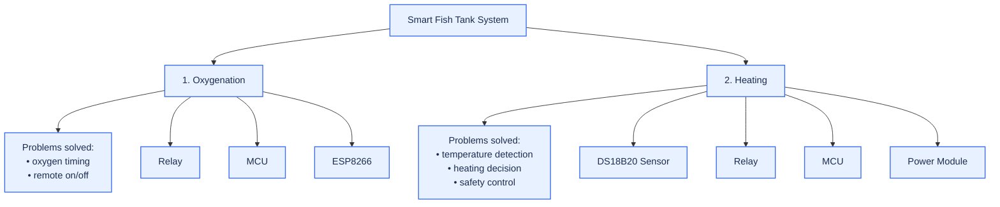

```mermaid
graph TB

    %% 统一蓝色背景的样式
    classDef blue fill:#e8f1ff,stroke:#3c6df0,stroke-width:1.5px,color:#1d2d50;

    %% 第一层：系统
    A[Smart Fish Tank System]:::blue

    %% ---- Oxygenation ----
    A --> B[1. Oxygenation]:::blue

    B --> B1[Problems solved:<br>• oxygen timing<br>• remote on/off]:::blue
    B --> B2[Relay]:::blue
    B --> B3[MCU]:::blue
    B --> B4[ESP8266]:::blue

    %% ---- Heating ----
    A --> C[2. Heating]:::blue

    C --> C1[Problems solved:<br>• temperature detection<br>• heating decision<br>• safety control]:::blue
    C --> C2[DS18B20 Sensor]:::blue
    C --> C3[Relay]:::blue
    C --> C4[MCU]:::blue
    C --> C5[Power Module]:::blue
```
