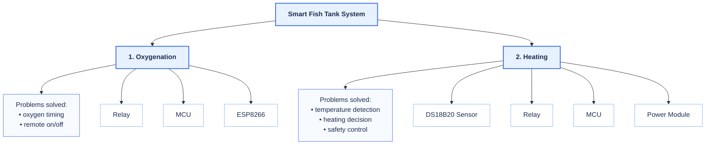

```mermaid
graph TB
    %% 全局样式
    classDef title fill:#e8f1ff,stroke:#3c6df0,stroke-width:2px,color:#1d2d50,font-weight:bold;
    classDef layer2 fill:#f7faff,stroke:#6a89f7,stroke-width:1.2px,color:#1d2d50;
    classDef device fill:#ffffff,stroke:#8ab4ff,stroke-width:1px,color:#1d2d50;

    A[Smart Fish Tank System]:::title

    %% Oxygenation
    A --> B[1. Oxygenation]:::title
    B --> B1[Problems solved:<br>• oxygen timing<br>• remote on/off]:::layer2
    B --> B2[Relay]:::device
    B --> B3[MCU]:::device
    B --> B4[ESP8266]:::device

    %% Heating
    A --> C[2. Heating]:::title
    C --> C1[Problems solved:<br>• temperature detection<br>• heating decision<br>• safety control]:::layer2
    C --> C2[DS18B20 Sensor]:::device
    C --> C3[Relay]:::device
    C --> C4[MCU]:::device
    C --> C5[Power Module]:::device
```
