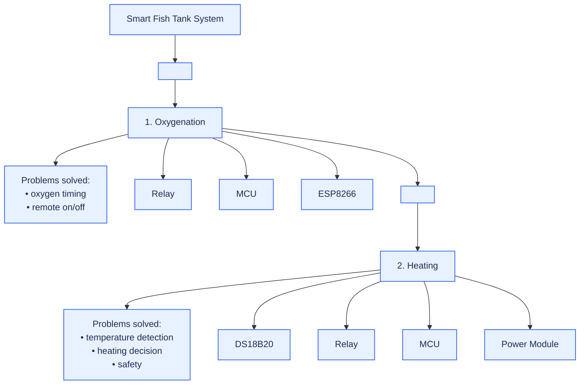

```mermaid
graph TB

    %% 蓝色样式
    classDef blue fill:#e8f1ff,stroke:#3c6df0,stroke-width:1.4px,color:#1d2d50;

    %% 顶层
    Top[Smart Fish Tank System]:::blue

    %% --- 强制创建一个“隐藏层”，让 Oxygenation 和 Heating 不在同一水平线上 ---
    Placeholder1[" "]:::blue
    Top --> Placeholder1

    %% --- 1. Oxygenation ---
    Placeholder1 --> O1[1. Oxygenation]:::blue

    O1 --> O1P[Problems solved:<br>• oxygen timing<br>• remote on/off]:::blue
    O1 --> O2[Relay]:::blue
    O1 --> O3[MCU]:::blue
    O1 --> O4[ESP8266]:::blue

    %% --- 再创建一个隐藏层，强制让 Heating 再往下一层 ---
    Placeholder2[" "]:::blue
    O1 --> Placeholder2

    %% --- 2. Heating ---
    Placeholder2 --> H1[2. Heating]:::blue

    H1 --> H1P[Problems solved:<br>• temperature detection<br>• heating decision<br>• safety]:::blue
    H1 --> H2[DS18B20]:::blue
    H1 --> H3[Relay]:::blue
    H1 --> H4[MCU]:::blue
    H1 --> H5[Power Module]:::blue
```
