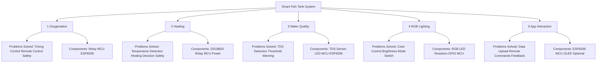

```mermaid
graph TD
    A[Smart Fish Tank System]

    A --> B[1 Oxygenation]
    B --> B1[Problems Solved: Timing Control Remote Control Safety]
    B --> B2[Components: Relay MCU ESP8266]

    A --> C[2 Heating]
    C --> C1[Problems Solved: Temperature Detection Heating Decision Safety]
    C --> C2[Components: DS18B20 Relay MCU Power]

    A --> D[3 Water Quality]
    D --> D1[Problems Solved: TDS Detection Threshold Warning]
    D --> D2[Components: TDS Sensor LED MCU ESP8266]

    A --> E[4 RGB Lighting]
    E --> E1[Problems Solved: Color Control Brightness Mode Switch]
    E --> E2[Components: RGB LED Resistors GPIO MCU]

    A --> F[5 App Interaction]
    F --> F1[Problems Solved: Data Upload Remote Commands Feedback]
    F --> F2[Components: ESP8266 MCU OLED Optional]
```
